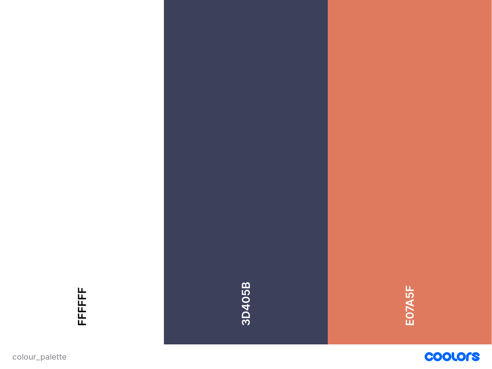

# **Dog O Mugs**

## **Goal for this project**
Welcome to [Dog O Mugs](https://dogomugs.herokuapp.com)!

A full e-commerce website built in Django for purchasing mugs and bottles.

The web-shop was created to provide customers with a wide range of quality bottles and mugs featuring various creative designs of dogs.

The website's user-friendly and easy-to-access layout provides a simple and fun shopping experience to customers.

Thank you for visiting!

Should you have any questions regarding my project feel free to reach out to me via the provided GitHub contact details.  

At the time of submission of this project the deployed version is identical to the latest development version of the "main" branch.  

## Table of contents 
- [**Dog O Mugs**](#dog-o-mugs)
  - [**Goal for this project**](#goal-for-this-project)
  - [Table of contents](#table-of-contents)
  - [User Experience](#user-experience)
    - [Target Audience](#target-audience)
    - [User Goal](#user-goal)
    - [User Stories](#user-stories)
    - [Site owners Goals](#site-owners-goals)
    - [Design Choices](#design-choices)
    - [Colours](#colours)
    - [Structure](#structure)
    - [Logo](#logo)
    - [Fonts](#fonts)
    - [Icons](#icons)
    - [Images](#images)
    - [Wireframes](#wireframes)
      - [Desktop Wireframes](#desktop-wireframes)
      - [Tablet Wireframes](#tablet-wireframes)
      - [Mobile Wireframes](#mobile-wireframes)
      - [Additional wireframes](#additional-wireframes)
  - [**Technologies used**](#technologies-used)
    - [**Languages**](#languages)
    - [**Libraries and Frameworks**](#libraries-and-frameworks)
    - [**Tools**](#tools)
  - [**Structure**](#structure-1)
    - [**Landing/Home page**](#landinghome-page)
    - [**Products page**](#products-page)
    - [**Basket page**](#basket-page)
    - [**My Orders page**](#my-orders-page)
    - [**Contact Us page**](#contact-us-page)
    - [**Login page**](#login-page)
    - [**Register page**](#register-page)
    - [**Flowchart**](#flowchart)
    - [**Database Structure**](#database-structure)
    - [**Testing**](#testing)
  - [**Local Deployment**](#local-deployment)
  - [**Heroku Deployment**](#heroku-deployment)
  - [**Credits**](#credits)

## User Experience

### Target Audience

- Potential buyers of current product range of mugs and bottles featuring dog themed designs.
- Customers looking for practical and quality gifts for dog lovers.
- Dog lovers searching for products with designs of dogs.

### User Goal
* A web-shop containing products of bottles and mugs with dog themed designs.
* A fully responsive website that is accessible and easy to use on desktop, tablet & mobile.
* Appealing, modern and clear design.
* Visibility of products in my basket, and an easy way to edit, delete or pay for these items.
* Providing option to share products on social media.
* Direct links to social media sites.

### User Stories

Key requirements of site users:

* As a new user, I want to be able to create my own account.
* As an existing user, I want to be able to log in to my account.
* As an existing user, I want to be able to update my account details if required.
* As a user, I want the navigation links work properly.
* As a user browsing products, I want to be able to easily navigate on the products page.
* As a user interested in a particular product or design, I want to be able to search for items.
* As a user interested in the business, I want to be able to find information about the company.
* As a user purchasing an item, I want to be able to see the content of my basket, alter quantities or remove products from my cart.
* As a user, I want the correct total price displayed in the basket before checkout.
* As a user finalising a purchase, I want to be able to provide my shipping information.
* As a user finalising a purchase, I want to be able to securely pay for my purchase.
* As a user with finalised purchase I want to be able to view my ordered products.
* As a user, I want to be able to share Dog O Mugs on social media.
* As a user, I want my details kept confident at all times.
* As a user, I want external links to open in a new window.

### Site owners Goals

* As a site owner, I want to promote my products the best way possible to attract new customers.
* As a site owner, I want to increase profit by reaching a wider audience.
* As a site owner, I want to be able to overview and process orders.
* As a site owner, I want to be able to provide customers with an easily accessible clear e-commerce site with a simple flow to increase user experience while shopping.
* As a site owner, I want new customers to be able to register and create an account.
* As a site owner, I want existing customers to be able to return and log into their account.
* As a site owner, I want information about the company and products to be available for customers.
* As a site owner, I want customers to be able to contact us through the website.
* As a site owner, I want to be able to review and update stock levels through the admin site.
* As a site owner, I want to be able to add new products through the admin site.
* As a site owner, I want to be able to modify existing product name, description or price through the admin site.
* As a site owner, I want the payment system to be secure and reliable.

[Back to Top](#table-of-contents)

### Design Choices

The website's main functionality is to sell mugs and bottles featuring designs of dogs. The design choices are clear and simple directing the user's attention to the products. The website is featuring some bold colours while keeping the flow clear and simple for customers. 

### Colours

The colour palette was created via [Coolors](https://coolors.co/ "Coolors.co")

* #FFFFFF: The background of the overall website is white in order achieve a clean and modern look. 
* #3D405B: This color is used in buttons and footer to create contrast.
* #E07A5F: This colour is used as a feature colour to draw attention to different sections and highlight active buttons. This colour matches the Dog O Mugs logo colour.
### Structure

The website's structure was created with the use of [Bootstrap 5](https://getbootstrap.com/) to ensure compatibility across various devices.

### Logo

The Dog O Mugs logo was created via [Looka](https://looka.com/ "Looka.com").

### Fonts

Fonts are customised via [Google Fonts](https://fonts.google.com)

### Icons
Icons are implemented from [Fontawesome](https://fontawesome.com)
Fav icons are created via [Favicon](https://favicon.io/favicon-generator/) 

### Images
Images used from:
* [Pexel](https://www.pexels.com)
* [Stock Vault](https://www.stockvault.net)
* [Unsplash](https://unsplash.com)

### Wireframes
#### Desktop Wireframes
* [Home](/docs/wireframes/home_desktop.png)
* [Basket](/docs/wireframes/basket_desktop.png)
* [Register](/docs/wireframes/register_desktop.png)
* [Login](/docs/wireframes/login_desktop.png)
* [Contact us](/docs/wireframes/contactus_desktop.png)
* [Order details](/docs/wireframes/orderdetails_desktop.png)
* [Order list](/docs/wireframes/orderlist_desktop.png)
* [Shipping details](/docs/wireframes/shipping_desktop.png)

#### Tablet Wireframes
* [Home](/docs/wireframes/home_tablet.png)
* [Basket](/docs/wireframes/basket_tablet.png)
* [Register](/docs/wireframes/register_tablet.png)
* [Login](/docs/wireframes/login_tablet.png)
* [Contact us](/docs/wireframes/contactus_tablet.png)
* [Order details](/docs/wireframes/orderdetails_tablet.png)
* [Order list](/docs/wireframes/orderlist_tablet.png)
* [Shipping details](/docs/wireframes/shipping_tablet.png)

#### Mobile Wireframes
* [Home](/docs/wireframes/home_mobile.png)
* [Basket](/docs/wireframes/basket_mobile.png)
* [Register](/docs/wireframes/register_mobile.png)
* [Login](/docs/wireframes/login_mobile.png)
* [Contact us](/docs/wireframes/contactus_mobile.png)
* [Order details](/docs/wireframes/orderdetails_mobile.png)
* [Order list](/docs/wireframes/orderlist_mobile.png)
* [Shipping details](/docs/wireframes/shipping_mobile.png)

#### Additional wireframes
* [Error page](/docs/wireframes/error_page.png)
* [Toast message](/docs/wireframes/toast_message.png)

[Back to Top](#table-of-contents)

## **Technologies used**
### **Languages**

* [HTML](https://en.wikipedia.org/wiki/HTML)
* [CSS](https://en.wikipedia.org/wiki/Cascading_Style_Sheets)
* [JavaScript](https://en.wikipedia.org/wiki/JavaScript)
* [Python](https://www.python.org/)

### **Libraries and Frameworks**

* [Font Awesome](https://fontawesome.com/)
* [Google Fonts](https://fonts.google.com/)
* [Stripe](https://http://stripe.com/)

### **Tools**
* [Django](https://www.djangoproject.com)
* [GitHub](https://github.com)
* [VS Code](https://vscode.dev)
* [Heroku](https://www.heroku.com/)
* [AWS](https://www.aws.com/)
* [Balsamic](https://balsamiq.com/wireframes/)
* [W3C HTML Validation Service](https://validator.w3.org/)
* [W3C CSS Validation Service](https://jigsaw.w3.org/css-validator/)
* [JSHint](https://jshint.com)
* [Am I Responsive](https://amiresponsive.co.uk)
* [Smart draw](https://smartdraw.com/)

[Back to Top](#table-of-contents)

## **Structure**

### **Landing/Home page**

The carousel image showcases some of the products to peak customers' interest. When clicking on any images of the carousel the user is redirected to the products list. There is a short welcome message and on the bottom of the page users can find the frequently asked questions. Under the FAQ section there is a prompt and link to the contact us form for any further queries. In the footer relevant social media buttons are included.

### **Products page**

On the Products page6 products are listed per page in individual cards containing basic information of the product such as image of the product, product name, price, and current stock.  
A search bar is integrated in the top of the page to enable user to search for names of products that are currently in stock.  
By clicking the "Products" navbar item a drop down menu opens where the existing product categories are listed to make filtering and finding products more simple. 
By clicking the "Product Details" button the customer is redirected to the detailed product view where a detailed description is visible with the option to add item to the basket or return to the "Products" page. When clicking on the "Add to basket" button user is redirected to the Basket.
User can only add item to the cart while logged in, in other case they are redirected to the login/register page.

### **Basket page**

Basket is only visible while user is logged in.
If the basket is empty, a "You have no items in your basket!" message appears and a link to the products.  
If there are items in the basket, these are all listed with information about the product name, quantity, price per item and the total is visible on the bottom of the list.  
The customer has the option to update product quantity or remove item from the basket by adjusting the quantity/pressing delete button then confirming the change by clicking on the "save changes" button.  
The customer has the option to either keep shopping and return to the product page or proceed to checkout.  
On checkout the user is directed to the shipping page where customer details can be entered. Once the form is submitted user is redirected to Stripe Checkout where after entering payment details the transaction happening. On successful payment the user is redirected to the payment success page to confirm this.

### **My Orders page**

This page is only visible when user is logged in.  
On the My Orders page the logged in user's previous orders are listed with basic information displayed in cards. There are 6 cards displayed per page.  
On clicking the "Order Details" button user is redirected to a detailed view of the chosen order where the previously bought items are listed with quantity and price, the payment status (completed or pending indicated by icons) as well as the shipping address that its been delivered to. There is a button on the bottom of the page to return to all orders list view.

### **Contact Us page**

This page is visible to all users.  
The contact us form enables anyone to send a message to the website owner.
On submission of the message (by clicking "Send Message" button) user is redirected to the contact success page to give a feedback message to user.

### **Login page**

On the Log in page user can log into their account by providing their username and password.  
On successful login a welcome toast message gives feedback to the user. On log out a successfully logged out toast message gives feedback to the user. 
There is a short prompt message and a link available for user that doesn't have an account yet to register. This link directing users to the Register page.

### **Register page**

Register page is not available for users that are already logged in.
Upon providing a valid username, e-mail address, and password an account can be created via clicking the "Register" button. Following a successful registration user is logged in as well as redirected to the Home page. A toast message appears to give feedback to the user about the successful registration.

### **Flowchart**

The flowchart was created via [Smart draw](https://smartdraw.com/).  

[Back to Top](#table-of-contents)

### **Database Structure**

### **Testing**

Testing is available in [TESTING.md](./TESTING.md).

## **Local Deployment**

To create this project I have used VS Code. 
After each separate section of code I added commits to myGithub repository.

In order to be able to run this project locally, follow these steps:

* To clone the project from my [Github repository](https://github.com/DoriCzele/dogomugs) click the code button and download the zip file.

* Open the project folder in your chosen code editor and install required modules using the following command:

      pip3 install -r requirements.txt

* Create a called env.py file at the root level containing your environmental variables:

      import os
      os.environ["SECRET_KEY"] = "YOUR_SECRET_KEY"
      os.environ["DEVELOPMENT"] = "True"
      os.environ["STRIPE_KEY"] = "YOUR_STRIPE_KEY"
      os.environ["AWS_ACCESS_KEY_ID"] = "YOUR_AWS_ACCESS_KEY_ID"
      os.environ["AWS_SECRET_ACCESS_KEY"] = "YOUR_AWS_SECRET_ACCESS_KEY"

Ensure env.py is added to .gitignore before pushing this application to a public repository.  

* Migrate the database models:
  
      python3 manage.py migrate

* Create a superuser and credentials:
      
      python3 manage.py createsuperuser

* Run the app:

      python manage.py runserver

The local website access is displayed in the terminal.
Admin panel is accessible by adding /admin to the end of the local address. Use superuser credentials to login to admin.

## **Heroku Deployment**

For this project a Stripe account (for payments) is necessary to create as well as an AWS where the static media files are stored for his project. 

## **Credits**

* I would like to thank my mentor Simen [Eventyret_mentor](https://github.com/Eventyret) for his support and encouragement throughout the course.

[Back to Top](#table-of-contents)