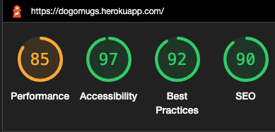

# Testing

## Table of contents 
- [Testing](#testing)
  - [Table of contents](#table-of-contents)
  - [**Validation across site**](#validation-across-site)
  - [**Responsiveness across site**](#responsiveness-across-site)
  - [**Lighthouse Report**](#lighthouse-report)
    - [**Home desktop**](#home-desktop)
    - [**Home mobile**](#home-mobile)
    - [**Basket desktop**](#basket-desktop)
    - [**Basket mobile**](#basket-mobile)
    - [**Contact us desktop**](#contact-us-desktop)
    - [**Contact us mobile**](#contact-us-mobile)
    - [**Login desktop**](#login-desktop)
    - [**Login mobile**](#login-mobile)
    - [**Register desktop**](#register-desktop)
    - [**Register mobile**](#register-mobile)
    - [**My Orders desktop**](#my-orders-desktop)
    - [**My Orders mobile**](#my-orders-mobile)
    - [**Order Details desktop**](#order-details-desktop)
    - [**Order Details mobile**](#order-details-mobile)
    - [**Products desktop**](#products-desktop)
    - [**Products mobile**](#products-mobile)
    - [**Product Details desktop**](#product-details-desktop)
    - [**Product Details mobile**](#product-details-mobile)
    - [**Shipping desktop**](#shipping-desktop)
    - [**Shipping mobile**](#shipping-mobile)
  - [**Base**](#base)
  - [**Home page**](#home-page)
  - [**Products page**](#products-page)
  - [**Product Details page**](#product-details-page)
  - [**Basket page**](#basket-page)
  - [**Shipping page**](#shipping-page)
  - [**My Orders page**](#my-orders-page)
  - [**Order Details page**](#order-details-page)
  - [**Login/Register page**](#loginregister-page)
  - [**Contact Us page**](#contact-us-page)

## **Validation across site**
All the html files checked and passed without any issue through [HTML Validator](https://validator.w3.org/).  
All the css files checked and passed without any issue through [CSS Validator](https://jigsaw.w3.org/css-validator/).  
All the javascript files are checked and passed without any issue through [Javascript Validator](https://jshint.com/).  
All python files checked and formatted without any issue through [PEP8](http://pep8online.com/). 

## **Responsiveness across site**
Tested and passed on various devices and displays: mobile, tablet and desktop.
Tested and passed across various browsers: Google Chrome, Safari, Firefox.

## **Lighthouse Report**
### **Home desktop**

### **Home mobile**

### **Basket desktop**

### **Basket mobile**

### **Contact us desktop**

### **Contact us mobile**

### **Login desktop**

### **Login mobile**

### **Register desktop**

### **Register mobile**

### **My Orders desktop**

### **My Orders mobile**

### **Order Details desktop**

### **Order Details mobile**

### **Products desktop**

### **Products mobile**

### **Product Details desktop**

### **Product Details mobile**

### **Shipping desktop**

### **Shipping mobile**

## **Base**

Visible to all users at all time.

* Navbar  
    Navbar is positioned correctly and fully responsive (changes to burger icon on smaller devices as expected). Navbar items are highlighted on hover over. All navigation bar items navigating to the correct links. Dropdown menu for Products is fully functional, on click it navigates to each product categories as well as to All Products. 

* Footer  
    Footer icons are displayed in the correct position and size. Icons color changes on hover over. Social media icons navigating to the correct links and displaying on a new window.  

## **Home page** 

Visible to all users at all time.

* Carousel images  
    Carousel images is of high quality and positioned correctly across all devices and browsers. 
    Arrows navigating to the next and previous images are positioned and displayed correctly at mid-height on both ends of the images. All carousel items navigate to the products list view on click.

* Logo image  
    Logo image is displayed in the correct position on all views and devices. Logo image navigates to home page on click.

* FAQ
    FAQ accordion style and iotems are displayed as expected.
    The questions and answers in the faq model are created, modified or deleted successfully through Django Admin. 
## **Products page**

Visible to all users at all time.

* Product cards  
    Product cards are displayed in a clear and organised way across all devices. In the preview the product image, name, price and current stock level is displayed for each item.  
    Products are created, modified and deleted successfully through Django Admin, where the product modal accessible for admin.  
    When current stock level equals 0, item is unavailable, therefore it is temporarily removed from the product list and not displayed for users.
    On clicking a product's image it navigates user to the detailed product view as well ad the "Product Details" button. 
    The "Product Details" button displayed clearly in the correct position and highlights on hover over.
    
* Pagination  
    Due to the pagination implemented, 6 product items are displayed per page across all devices. Pages are numbered and the active page number displayed on the bottom of the page. Pages are navigated via the left and right arrows on the bottom of the page.

* Product categories
    When clicking "Products" dropdown on navbar, product category can be selected. Only products that are filtered to the category are displayed on the page.  
    Product categories and their items are added to the site through Django Admin, therefore easy to update or remove any categories or products within.

* Search bar
    The search bar is only displayed on the Products page and is only searching in product names. Search button displayed and functioning as expected. If product search doesn't return a result "No products were found that match your search query." message shows.

## **Product Details page**

Visible to all users at all time.

* Text areas  
    Product information and detailed product description are displayed as expected.  

* Images  
    Product image is displayed correctly across all devices.  

* Buttons  
    "Back" button displayed and styled as expected, taking user back to the Products page on click. "Add to basket" button displayed and functioning as expected. If user is logged in, "Add to basket" button is adding the product to the basket and redirecting user to the Basket page. If not, user is redirected to login page, where following login/registration user can continue shopping.

## **Basket page**

Only visible to users who are logged in.

* Text areas  
    Products in the basket are listed individually showing product name, quantity, and unit price in GBP. Basket is showing the correct total price in GBP.

* Buttons  
    Buttons are displayed and styled as expected. The "Keep shopping" button successfully redirecting user back to the products list. Quantity of each listed items are successfully updated and saved via the "Save" button. "Checkout" button is successfully redirecting user to the Shipping page where customers can enter their details. 

* Item quantity
    The maximum quantity of an item in the basket cannot be more than the current stock level of the given product. If user types in a greater quantity, the quantity is automatically updated to the  highest available quantity on stock.

If Basket is empty, item list and buttons are hidden, and a message is displayed with a link to All Products.

## **Shipping page**

Only visible to users who are logged in.

This form was built via the use of crispy-form.

* Text areas  
    Text is displayed as expected.  

* Images  
    Image is displayed correctly across all devices. 

* Form
    Form validation on all input fields working as expected. Shipping form is pre-populated with the user's most recent details. On form submission, user is successfully redirected to Stripe to process payment. Following the successful payment user is redirected to a "payment successful" page where has the option to navigate back to Products or Home page. In case the payment wasn't successful, user can retry by resuming the most recent order in "My Orders". 
    
## **My Orders page**

Only visible to users who are logged in.

* Text areas  
    All text is displayed as expected.

* Buttons
    "Order Details" button successfully redirecting user to the Detailed Order view.

* Pagination  
    Due to the pagination implemented, 6 product items are displayed per page across all devices. Pages are numbered and the active page number displayed on the bottom of the page. Pages are navigated via the left and right arrows on the bottom of the page.

* Order cards  
    User's previous orders in the list view are displayed in cards, starting with the most recent. Preview-cards contain information about the date and time the order has been placed, the full amount paid and payment status (a tick or x indicating successful/failed payment). 

In case a previous order contains 0 products, a filter has been implemented therefore the order is not visible under My Orders.

## **Order Details page**

Only visible to users who are logged in.

* Text areas  
    All text is displayed as expected. The Order Details contain the list of products ordered at the given date, price per item and quantity, the total paid for the order as well as the shipping address.

* Images  
    Image is displayed correctly across all devices

* Buttons
    "Back to all orders" button successfully redirecting user to the listed view of previous orders on the "My Orders" page. "Continue payment" button is only visible when payment status is unsuccessful on the previous order and successfully redirects user to Stripe to resume/retry the transaction.

 * In previous orders the item prices displayed are "frozen" at the current price of that item at the time of placing the order. This feature was implemented to allow traceability and comparability for users, even if later the product price changes the users is able to see the exact amount they paid when placing that order.

## **Login/Register page**

Visible to all users at all time.

These forms were built via the use of crispy-form.

* Text areas  
    All text is displayed as expected.

* Images  
    Image is displayed correctly across all devices.

* Buttons
    Login/register buttons are displayed as expected across all devices and redirecting users to the correct links.

* Login
    Upon providing a valid username and password, previously registered users can login to shop and/or access My Orders and Basket. In case invalid input is submitted, login fails, and user is requested to update these to valid details, (as part of the crispy-form validation guidelines are displayed to user). 
    Upon successful login, a toast message is shown providing feedback of the interaction to the user.  
    There is a prompt and link displayed on the Login page which on click redirecting user to the "Register" page. This feature is allowing users to switch between Login and Register.

* Register
    Upon providing a valid username, email address and password, users can register to the website. In case invalid input is submitted, registration fails, and user is requested to update these to valid details, (as part of the crispy-form validation guidelines are displayed to user). Upon successful registration, a toast message is shown providing feedback of the interaction to the user.

## **Contact Us page**

Visible to all users at all time.

These form was built via the use of crispy-form.

* Text areas  
    All text is displayed as expected.

* Images  
    Image is displayed correctly across all devices.

* Form
    Message cannot be submitted if either email address field or text field are empty. Submitted messages can be read by the admin through the Django Admin.